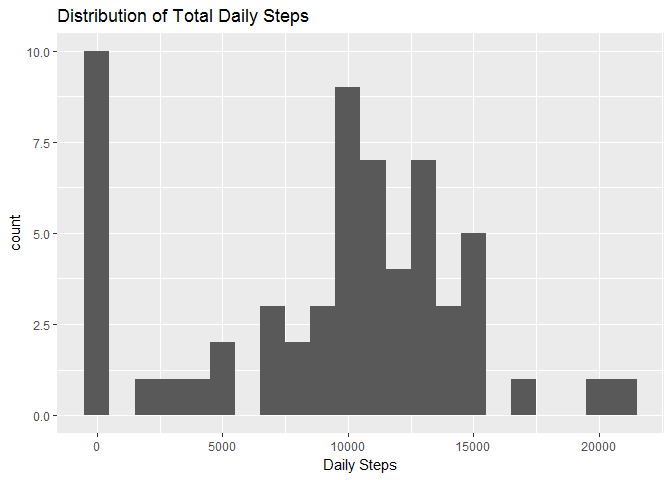
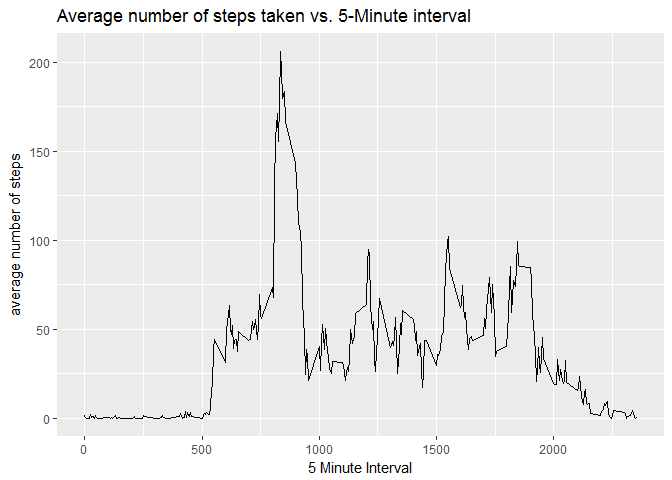
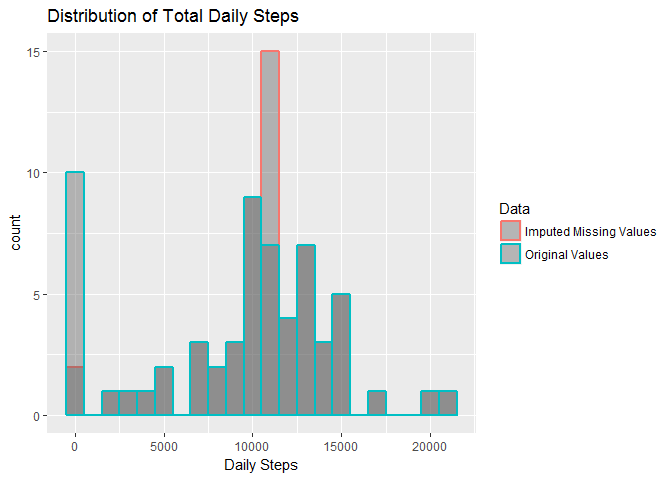
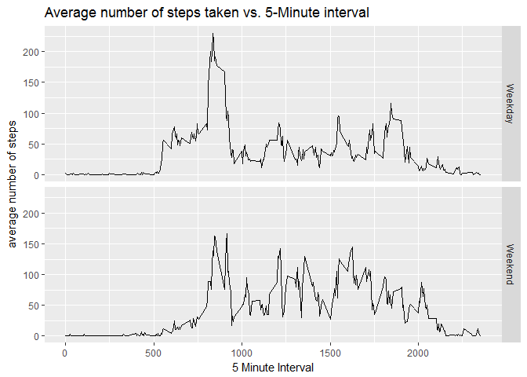

# Reproducible Research: Peer Assessment 1
Jeremy Voisey  
17 March 2017  


## Introduction
It is now possible to collect a large amount of data about personal movement
using activity monitoring devices such as a Fitbit, Nike Fuelband, or Jawbone
Up. These type of devices are part of the "quantified self" movement - a group
of enthusiasts who take measurements about themselves regularly to improve
their health, to find patterns in their behavior, or because they are tech geeks.
But these data remain under-utilized both because the raw data are hard to
obtain and there is a lack of statistical methods and software for processing
and interpreting the data.

This assignment makes use of data from a personal activity monitoring device.
This device collects data at 5 minute intervals through out the day. The data
consists of two months of data from an anonymous individual collected during
the months of October and November, 2012 and include the number of steps
taken in 5 minute intervals each day.

## Loading and preprocessing the data
The variables included in this dataset are:

- steps: Number of steps taking in a 5-minute interval (missing values are coded
as NA)

- date: The date on which the measurement was taken in YYYY-MM-DD format

- interval: Identifier for the 5-minute interval in which measurement was taken

The dataset is stored in a comma-separated-value (CSV) file and there are a
total of 17,568 observations in this dataset.

The file was read into a data frame, activity


```r
filename <- "activity/activity.csv"
activity <- read.csv(filename, stringsAsFactors = FALSE)
```


## What is mean total number of steps taken per day?


```r
suppressMessages(library(dplyr))

dailysteps <- activity %>%
    group_by(date) %>%
    summarise(dailysteps = sum(steps, na.rm = TRUE))
```

### The distribution of total daily steps


```r
suppressMessages(library(ggplot2))
ggplot(dailysteps, aes(x = dailysteps)) +
    geom_histogram(binwidth = 1000) +
    labs(x = "Daily Steps", title = "Distribution of Total Daily Steps")
```

<!-- -->

### The mean and median of total daily steps


```r
mean_dailysteps <- round(mean(dailysteps$dailysteps),0)
median_dailysteps <- median(dailysteps$dailysteps)
```

The mean number of daily steps was 9354,
the median was 10395

## What is the average daily activity pattern?

```r
dailyactivity <- activity %>%
    group_by(interval) %>%
    summarise(averagesteps = mean(steps, na.rm = TRUE))
```

### Average number of steps taken vs. 5-Minute interval

```r
library(ggplot2)
ggplot(dailyactivity, aes(x = interval, y = averagesteps)) +
    geom_line() +
    labs(x = "5 Minute Interval", y = "average number of steps", title = "Average number of steps taken vs. 5-Minute interval")
```

<!-- -->

#### Maximum number of steps

```r
maxinterval <- dailyactivity[which.max(dailyactivity$averagesteps), "interval"]
```

The interval containing the maximum number of steps on average was 835

## Imputing missing values

```r
missingsteps <- sum(is.na(activity$steps))
rowcount <- nrow(activity)
```

There are 2304 rows, missing values out of 17568

Missing values were filled in by assuming that the number of steps in that
interval was equal to the average for that interval across all days


```r
# Make copy of activity data.frame
filled_activity <- activity
# Identify rows with missing values
whichna <- which(is.na(filled_activity$steps))
# Loop over missing values and replace them with average for corresponding interval
for (rown in whichna) {
    intervalna <- filled_activity$interval[rown]
    filled_activity$steps[rown] <- with(dailyactivity,averagesteps[which(interval == intervalna)]) 
}
```

### What is mean total number of steps taken per day for Imputed data set?

```r
filled_dailysteps <- filled_activity %>%
    group_by(date) %>%
    summarise(dailysteps = sum(steps, na.rm = TRUE))
```

### The distribution of total daily steps using Imputed data set


```r
ggplot(filled_dailysteps, aes(x = dailysteps)) +
    geom_histogram(binwidth = 1000) +
    labs(x = "Daily Steps", title = "Distribution of Total Daily Steps (Imputed missing values)")
```

<!-- -->

### The mean and median of total daily steps using Imputed data set


```r
filled_mean_dailysteps <- round(mean(filled_dailysteps$dailysteps), 0)
filled_median_dailysteps <- round(median(filled_dailysteps$dailysteps), 0)
change_mean_dailysteps <- round(filled_mean_dailysteps - mean_dailysteps, 0)
change_median_dailysteps <- round(filled_median_dailysteps - median_dailysteps, 0)
```

The mean number of daily steps using imputed data was 10766.
This is a change of 1412.

The median was 10766.
This is a change of 371.

## Are there differences in activity patterns between weekdays and weekends?
A column was added indicating whether each day was a weekday or weekend

```r
filled_activity <- mutate(filled_activity, daytype = ifelse(as.POSIXlt(date)$wday == 0 | as.POSIXlt(date)$wday == 6, "Weekend", "Weekday"))
```

The daily activity was calculated grouped by interval and Weekend/Weekday

```r
daytype_dailyactivity <- filled_activity %>%
    group_by(interval, daytype) %>%
    summarise(averagesteps = mean(steps, na.rm = TRUE))
```

### Average number of steps taken vs. 5-minute interval by day type

```r
ggplot(daytype_dailyactivity, aes(x = interval, y = averagesteps)) +
    geom_line() +
    facet_grid(daytype ~ .) +
    labs(x = "5 Minute Interval", y = "average number of steps", title = "Average number of steps taken vs. 5-Minute interval")
```

<!-- -->
